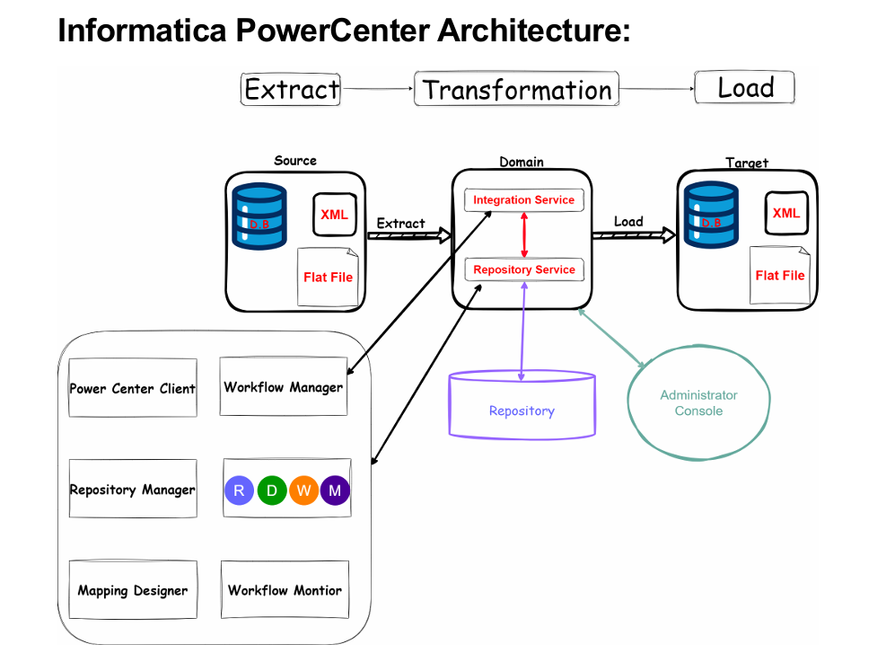

## Informatica PowerCenter Architecture

### Core components

- **Domain**: The top‑level container that holds and manages all services and nodes. You administer it via the web‑based Administrator Console.
- **Repository**: A database schema that stores all metadata (sources/targets, mappings, mapplets, workflows, sessions, connections, parameters, versions).
- **Repository Service (RS)**: Fronts the repository database. Handles check‑in/out, queries from client tools, object versioning, security, and locking.
- **Integration Service (IS)**: The runtime engine. It reads session/workflow instructions from the repository, connects to sources/targets, and moves/transforms data. Internally it spawns the DTM process with reader/transformer/writer threads, manages caching, partitions, commits, and recovery.
- **Client tools (PowerCenter Client)**:
  - **Repository Manager**: security, folders, object management, versions.
  - **Designer (Mapping Designer)**: build source/target definitions, mappings, mapplets, reusable transformations.
  - **Workflow Manager**: create sessions, tasks, and workflows; set schedules and runtime properties.
  - **Workflow Monitor**: run/monitor workflows, view logs, throughput, errors, and recovery states.
- **Sources and Targets**: Heterogeneous endpoints such as relational databases, XML, and flat files.
- **ETL flow**: Extract → Transform → Load. Data moves from Source to Target through mappings executed by the Integration Service, with metadata stored/served by the Repository Service.

### How components interact

- You design objects in the Client tools; they’re saved as metadata in the Repository via the Repository Service.
- You build sessions/workflows in Workflow Manager and start or schedule them.
- The Integration Service picks up the run request, fetches the mapping/session config from the Repository, connects to Sources/Targets, and runs the DTM pipeline (reader → transformations → writer).
- Runtime details and statistics are logged back to the Repository; you observe them in Workflow Monitor.
- Admin tasks like creating services, users, nodes, and licenses happen in the Administrator Console within the Domain.

